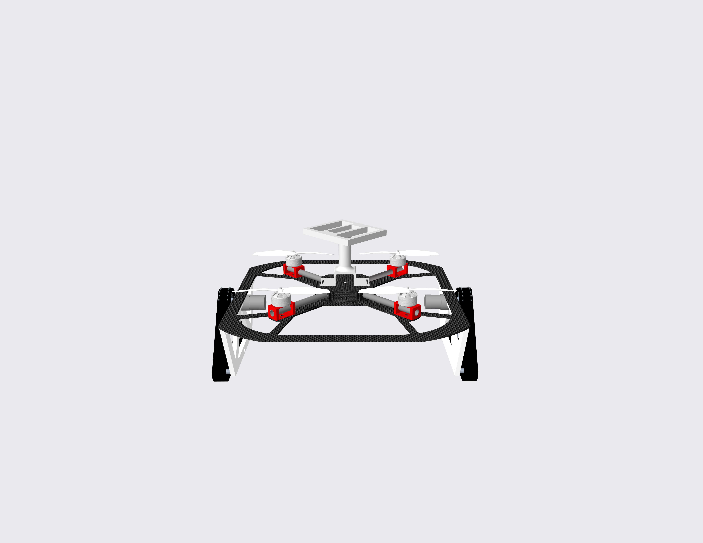
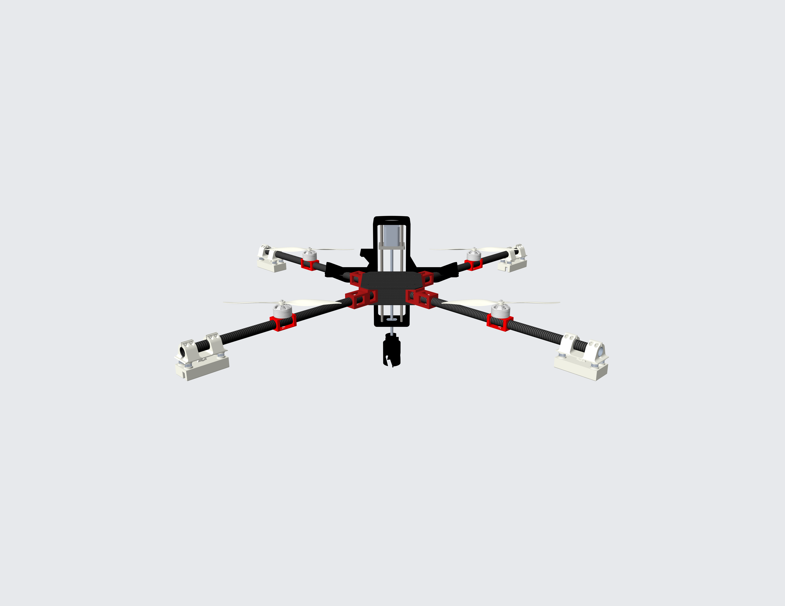

<div align="center">

# HARP

**Fly, Drive, Reconfigure: A Modular Reconfigurable Aerial-Ground Platform for Field Operations**

Li-Yu Lo\*, Yanbaihui Liu\*, Chengchuan Shu, Tyler Harris, Jonathan Ryan, Boyuan Chen

\* Equal contribution

General Robotics Lab, Duke University

**[Paper (arXiv)](https://arxiv.org/abs/2609.28887)** &middot;
**[PDF](https://arxiv.org/pdf/2609.28887)** &middot;
**[Hardware](CAD/README.md)** &middot;
**[Mapping](mapping/ros2_ws/src/mod_explore/MAP_EDITOR.md)** &middot;
**[Planning](path_planner/README.md)**

[](https://arxiv.org/abs/2609.28887)

</div>

HARP (**Heterogeneous Aerial Robotic modules Platform**) combines aerial scouts,
fly-drive rovers, and task-specific payloads. Modules fly independently and
physically assemble into a cooperative ground vehicle for payload transport.
This repository contains the hardware designs, ROS 2 mapping tools, and
energy-aware dynamic programming (DP) route planner accompanying the research.

## Abstract

Heterogeneous robot teams distribute complementary capabilities across specialized
agents, but their physical roles and capacities typically remain fixed throughout
a mission. We present HARP, a Heterogeneous Aerial Robotic modules Platform in which
independently deployable aerial robots physically reconfigure to compose their
capabilities for field operations. HARP comprises sensor-equipped scouts, fly-drive
rover modules, and task-specific payload modules. Scouts map the environment and
inform an energy-aware planner that jointly selects routes and air-ground mobility
modes. Rover and payload modules fly independently across terrain that constrains
ground travel, then autonomously assemble into a cooperative ground vehicle for
energy-efficient payload transport. Motivated by environmental sampling in remote
and difficult-to-traverse regions, we evaluate HARP through field experiments
spanning sensing, planning, reconfiguration, air-ground mobility, payload
transport, and task execution. We further conduct module-level deployment tests on
the Greenland Ice Sheet toward future autonomous missions. HARP demonstrates how
heterogeneous robot teams can adapt not only their actions, but also how their
physical capabilities are composed during a mission.

## System overview

The paper integrates terrain sensing, mobility planning, and physical
reconfiguration into a field-operation pipeline:

1. **Map:** A scout surveys the environment to provide terrain information.
2. **Plan:** An energy-aware DP planner jointly selects routes and aerial or
   ground mobility modes.
3. **Reconfigure and transport:** Rover and payload modules transition between
   independent flight and assembled ground travel.
4. **Execute:** A task-specific payload performs field operations, demonstrated
   with a drilling mechanism for subsurface sampling.

## Hardware

<table>
<tr>
<td width="50%"></td>
<td width="50%"></td>
</tr>
<tr>
<td><b>Fly-drive rover module.</b> Aerial deployment and ground mobility.</td>
<td><b>Drilling payload module.</b> Aerial deployment with a subsurface sampling mechanism.</td>
</tr>
</table>

See the [rover design](CAD/rover/README.md) and
[drilling payload design](CAD/drill/README.md) for CAD assemblies, part inventories,
and reference images.

## Repository

| Component | Contents | Documentation |
| --- | --- | --- |
| [CAD/](CAD/) | Rover and drilling payload designs, assembly inventories, and images. | [Hardware guide](CAD/README.md) |
| [mapping/](mapping/ros2_ws/src/) | ROS 2 tools for 2.5D mapping, exploration, PCD export, and browser-based map editing. | [Mapping and map editor guide](mapping/ros2_ws/src/mod_explore/MAP_EDITOR.md) |
| [path_planner/](path_planner/) | Air/ground DP planner, point-cloud terrain conversion, example maps, configuration, and regression tests. | [Planner setup and examples](path_planner/README.md) |

## Getting started

- **Explore the hardware:** Start with the [CAD guide](CAD/README.md) and the
  assembly inventories for each module.
- **Build or edit a terrain map:** Follow the
  [mapping guide](mapping/ros2_ws/src/mod_explore/MAP_EDITOR.md). Mapping consumes
  registered point clouds and odometry from a separately running FAST-LIO instance.
- **Run the planner on an example map:** Follow the
  [planner setup and examples](path_planner/README.md), which include Python
  dependencies, a sample command, visualization outputs, and point-cloud conversion.

## Citation

If you use HARP in your research, please cite the paper:

```bibtex
@misc{lo2026flydrivereconfigure,
  title         = {Fly, Drive, Reconfigure: A Modular Reconfigurable Aerial-Ground Platform for Field Operations},
  author        = {Li-Yu Lo and Yanbaihui Liu and Chengchuan Shu and Tyler Harris and Jonathan Ryan and Boyuan Chen},
  year          = {2026},
  eprint        = {2609.28887},
  archivePrefix = {arXiv},
  primaryClass  = {cs.RO},
  url           = {https://arxiv.org/abs/2609.28887}
}
```
